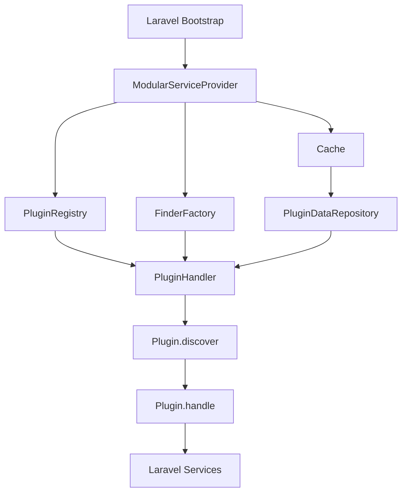

## Core Components

Laravel Modular is built on three fundamental components that work together to provide modular functionality:

<CardGroup cols={3}>
  <Card title="Plugin System" icon="plug">
    Discovers and registers module resources
  </Card>
  <Card title="Module Registry" icon="folder-tree">
    Manages module metadata and paths
  </Card>
  <Card title="Finder Factory" icon="magnifying-glass">
    Locates files within modules
  </Card>
</CardGroup>

## Service Provider Bootstrap

The `ModularServiceProvider` orchestrates the entire framework during Laravel's bootstrap process:

```php
class ModularServiceProvider extends ServiceProvider
{
    public function register(): void
    {
        // 1. Register the Module Registry
        $this->app->singleton(ModuleRegistry::class, fn(Application $app) => new ModuleRegistry(
            modules_path: $this->getModulesBasePath(),
            modules_loader: static function() use ($app) {
                return $app->make(PluginHandler::class)->handle(ModulesPlugin::class);
            },
        ));
        
        // 2. Register the Finder Factory
        $this->app->singleton(FinderFactory::class, fn() => new FinderFactory($this->getModulesBasePath()));
        
        // 3. Register the Cache
        $this->app->singleton(Cache::class, fn(Application $app) => new Cache(
            $app->make(Filesystem::class),
            $this->app->bootstrapPath('cache/app-modules.php')
        ));
        
        // 4. Register Plugin Data Repository
        $this->app->singleton(PluginDataRepository::class, fn(Application $app) => new PluginDataRepository(
            data: $app->make(Cache::class)->read(),
            registry: $app->make(PluginRegistry::class),
            finders: $app->make(FinderFactory::class),
        ));
        
        // 5. Register all plugins as singletons
        $this->app->singleton(PluginRegistry::class);
        $this->app->singleton(PluginHandler::class);
        
        // 6. Boot plugins
        $this->app->booting(fn() => $this->app->make(PluginHandler::class)->boot($this->app));
    }
}
```

<Note>
  All core components are registered as singletons to ensure consistent state throughout the application lifecycle.
</Note>

## Module Discovery Process

Modules are discovered through a multi-step process:

<Steps>
  <Step title="Locate composer.json files">
    The `FinderFactory` scans the modules directory for `composer.json` files at depth 1.
  </Step>
  
  <Step title="Parse module metadata">
    Each `composer.json` is parsed to extract the module name, base path, and PSR-4 namespaces.
  </Step>
  
  <Step title="Create ModuleConfig objects">
    Module metadata is stored in `ModuleConfig` objects containing:
    - Module name (directory name)
    - Base path (absolute path to module directory)
    - Namespaces (PSR-4 autoload mappings)
  </Step>
  
  <Step title="Register in ModuleRegistry">
    All modules are stored in the `ModuleRegistry` for quick access throughout the application.
  </Step>
</Steps>

### Module Discovery Code

```php
class ModulesPlugin extends Plugin
{
    public function discover(FinderFactory $finders): iterable
    {
        return $finders
            ->moduleComposerFileFinder()
            ->values()
            ->mapWithKeys(function(SplFileInfo $file) {
                $composer_config = json_decode($file->getContents(), true, 16, JSON_THROW_ON_ERROR);
                $base_path = rtrim(str_replace('\\', '/', $file->getPath()), '/');
                $name = basename($base_path);
                
                return [
                    $name => [
                        'name' => $name,
                        'base_path' => $base_path,
                        'namespaces' => Collection::make($composer_config['autoload']['psr-4'] ?? [])
                            ->mapWithKeys(fn($src, $namespace) => ["{$base_path}/{$src}" => $namespace])
                            ->all(),
                    ],
                ];
            });
    }
}
```

## Plugin Handler Lifecycle

The `PluginHandler` manages the plugin lifecycle in two phases:

### 1. Boot Phase

During application boot, plugins are initialized based on their attributes:

```php
class PluginHandler
{
    public function boot(Application $app): void
    {
        foreach ($this->registry->all() as $class) {
            $class::boot($this->handle(...), $app);
        }
    }
}
```

### 2. Handle Phase

When a plugin is executed, it receives discovered data and processes it:

```php
public function handle(string $name, array $parameters = []): mixed
{
    return $this->registry->get($name, $parameters)->handle($this->data->get($name));
}
```

## Caching System

Laravel Modular uses a caching system to avoid filesystem scans on every request:

<Accordion title="Cache File Location">
  The cache is stored at `bootstrap/cache/app-modules.php` and contains all discovered plugin data.
</Accordion>

<Accordion title="Cache Read Process">
  ```php
  class Cache
  {
      public function read(): array
      {
          try {
              return $this->fs->exists($this->path) ? require $this->path : [];
          } catch (Throwable) {
              return [];
          }
      }
  }
  ```
</Accordion>

<Accordion title="Cache Write Process">
  ```php
  public function write(array $data): bool
  {
      $cache = Collection::make($data)->toArray();
      $php = '<?php return '.var_export($cache, true).';'.PHP_EOL;
      
      $this->fs->ensureDirectoryExists($this->fs->dirname($this->path));
      
      if (! $this->fs->put($this->path, $php)) {
          throw new CannotWriteCacheException($this->path);
      }
      
      return true;
  }
  ```
</Accordion>

<Warning>
  Always run `php artisan modules:cache` in production to avoid filesystem scanning overhead.
</Warning>

## Module Registry API

The `ModuleRegistry` provides methods to access module information:

```php
class ModuleRegistry
{
    // Get a module by name
    public function module(?string $name = null): ?ModuleConfig
    
    // Get module from a file path
    public function moduleForPath(string $path): ?ModuleConfig
    
    // Get module from a class name
    public function moduleForClass(string $fqcn): ?ModuleConfig
    
    // Get all modules
    public function modules(): Collection
    
    // Reload modules from disk
    public function reload(): Collection
}
```

### Usage Examples

```php
use InterNACHI\Modular\Support\Facades\Modules;

// Get a specific module
$module = Modules::module('user-management');

// Get all modules
$all = Modules::modules();

// Find module for a class
$module = Modules::moduleForClass(App\Models\User::class);

// Get module path
$path = $module->path('src/Models');
```

## Finder Factory

The `FinderFactory` creates specialized finders for different file types:

```php
class FinderFactory
{
    public function moduleComposerFileFinder(): FinderCollection
    public function commandFileFinder(): FinderCollection
    public function routeFileFinder(): FinderCollection
    public function viewDirectoryFinder(): FinderCollection
    public function migrationDirectoryFinder(): FinderCollection
    public function modelFileFinder(): FinderCollection
    public function bladeComponentFileFinder(): FinderCollection
    public function langDirectoryFinder(): FinderCollection
    public function listenerDirectoryFinder(): FinderCollection
}
```

<Info>
  Each finder is pre-configured with the correct depth and patterns for its file type, ensuring consistent discovery across all modules.
</Info>

## Data Flow Diagram



## Configuration

The framework is configured via `config/app-modules.php`:

```php
return [
    // PHP namespace for modules
    'modules_namespace' => 'Modules',
    
    // Composer vendor name
    'modules_vendor' => null,
    
    // Directory where modules are stored
    'modules_directory' => 'app-modules',
    
    // Base test case class
    'tests_base' => 'Tests\\TestCase',
    
    // Custom stubs for module generation
    'stubs' => null,
    
    // Event discovery override
    'should_discover_events' => null,
];
```

<Note>
  The `modules_directory` is relative to your Laravel application's base path.
</Note>